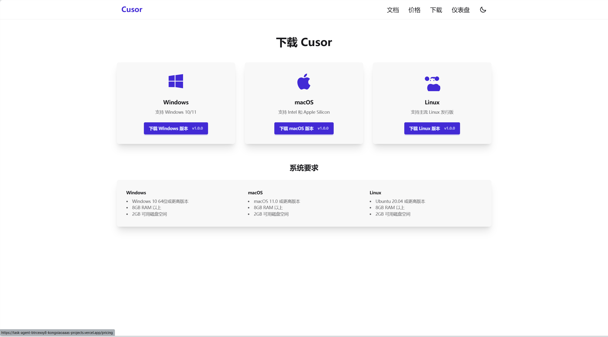

# React + TypeScript + Vite

## Code

```tsx
import { StrictMode } from 'react'
import { createRoot } from 'react-dom/client'
import App from './App'

import '@assets/styles/tailwind.css'

createRoot(document.getElementById('root')!).render(
  <StrictMode>
    <App />
  </StrictMode>
)
```

## Preview

- Home
  

- Download
  

- Pic
  

## Source

This template provides a minimal setup to get React working in Vite with HMR and some ESLint rules.
